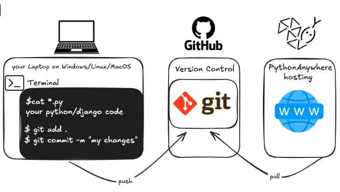

# randomfacts_app
Hosting on Python Anywhere

<p align="center">
  
</p>


- Sign up for PythonAnywhere, you'll be taken to your dashboard.
- Find the link near the top right to your "Account" page.
- Select the tab named "API token", and hit the button that says "Create new API token".
- Go backto Dashboard by clicking on the logo, and choose the option to start a "Bash" console.

  ```
	pip3.10 install --user pythonanywhere
	pa_autoconfigure_django.py --python=3.10 https://github.com/abuu94/randomfacts_app.git
	python manage.py createsuperuser

- Your site should now be live on the public Internet! Click through to the PythonAnywhere "Web" page to get a link to it.
- You can share this with anyone you want. :)

# Django Reset User Password Locally

- Go to command line interface in venv of the django project, and type the following
  
```
python manage.py shell
```

- Write the following code to access User model
  
```
from django.contrib.auth import get_user_model
User = get_user_model()
print(User.objects.filter(is_superuser=True).values_list('username', flat=True))
```


- Use the following to set new password for existing user
  
``
user = User.objects.get(username='abuu1')  
user.set_password('abu123pwd')  
user.save()
exit()
```
